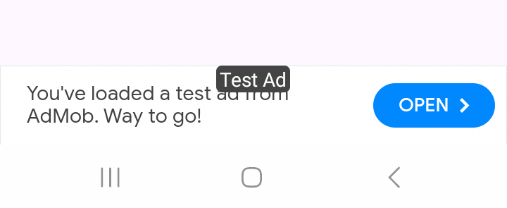

# BannerAds Library


## Update

- Updated to the latest version of Admob SDK
- Supported on Android SDK 30, 31, 32, 33, 34
- Updated RVAdapter to Kotlin

## For Developers

To maximize your app's revenue by displaying Banner Ads , follow the instructions below.

## How to Use the BannerAds Library

### Step 1: Add the JitPack Repository

Add the JitPack repository to your project’s build file:

**For Gradle (in `settings.gradle` for Android Studio Bumblebee or later):**

```gradle
dependencyResolutionManagement {
    repositoriesMode.set(RepositoriesMode.FAIL_ON_PROJECT_REPOS)
    repositories {
        google()
        mavenCentral()
        maven { url 'https://jitpack.io' } // Add this line
    }
}
```
  
  
Step 2. Add the dependency
  
```dependencies
	dependencies {
	        implementation 'com.github.samyak2403:BannerAds:1.0.1'
	}
```

## Layout Example:
 **Add the following XML layout code to your activity_main.xml:**
```xml
 <?xml version="1.0" encoding="utf-8"?>
<LinearLayout
    xmlns:android="http://schemas.android.com/apk/res/android"
    xmlns:tools="http://schemas.android.com/tools"
    android:layout_width="match_parent"
    android:layout_height="match_parent"
    android:orientation="vertical"
    android:padding="16dp"
    tools:context=".MainActivity">

    <!-- Other UI components can go here -->

    <!-- LinearLayout to contain the Banner Ad -->
    <LinearLayout
        android:id="@+id/bannerAdContainer"
        android:layout_width="match_parent"
        android:layout_height="wrap_content"
        android:gravity="center"
        android:orientation="vertical"
        android:layout_marginTop="16dp" />

    <!-- Other UI components can go here -->

</LinearLayout>
```


Step 3. In your MainActivity.kt, add the following code to initialize and load the banner ad:

kotlin:

  ```kotlin

        class MainActivity : AppCompatActivity() {
    override fun onCreate(savedInstanceState: Bundle?) {
        super.onCreate(savedInstanceState)
        enableEdgeToEdge()
        setContentView(R.layout.activity_main)
        ViewCompat.setOnApplyWindowInsetsListener(findViewById(R.id.main)) { v, insets ->
            val systemBars = insets.getInsets(WindowInsetsCompat.Type.systemBars())
            v.setPadding(systemBars.left, systemBars.top, systemBars.right, systemBars.bottom)
            insets
        }

        // Initialize Control class and load the banner ad
        val control = Control(this)
        val adUnitId = getString(R.string.admob_banner_id) // Fetch the AdMob banner ID from resources
        control.loadBannerAd(R.id.bannerAdContainer, adUnitId)
    }
}
  ```
```java         
 If you prefer Java, use the following setup in your MainActivity.java:


        // Initialize Control class and load the banner ad
        Control control = new Control(this);
        String adUnitId = getString(R.string.admob_banner_id); // Fetch the AdMob banner ID from resources
        control.loadBannerAd(R.id.bannerAdContainer, adUnitId);
 ```
  

      

## Demo
Native ads Small Layout |  Native ads Medium Layout
:-------------------------:|:-------------------------:
  |   
